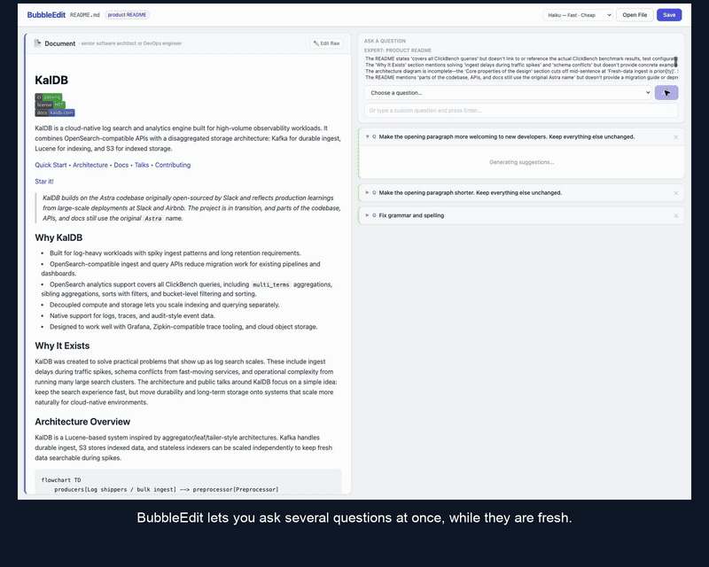

# BubbleEdit

An AI-powered Markdown editor for exploring several editing questions at once. Each answer gets its own bubble beside your document, so you can compare proposed changes before applying them and keep only the edits you want.

## Why we built BubbleEdit

Editing rarely raises just one question. Is the grammar right? Could the introduction be shorter? Does the wording raise possible legal issues? Each question can lead to a different rewrite, and the most extensive rewrite is not always the right one.

In a one-question-at-a-time chat workflow, waiting for an answer can interrupt your train of thought—you may forget the next question before the first response arrives. Comparing a rewrite with the original also takes work when they are separated by messages or screens. And even a useful answer may change more than you intended.

BubbleEdit keeps those questions and decisions visible:

- **Ask while the thought is fresh.** Submit multiple questions without waiting for earlier answers. Each request runs independently and produces its own question bubble.
- **Compare beside the document.** The document stays on the left; question bubbles and their diffs appear on the right. Switch between bubbles to inspect how different requests would change the document before committing to an edit.
- **Keep only what helps.** Accept or reject individual changes within a response, or accept or reject the whole proposal. “Accept All” applies undecided changes while preserving any explicit rejections.
- **Start with a prompt or write your own.** Built-in tasks include “Fix grammar and spelling,” “Make it more concise,” and “Improve clarity and flow.” BubbleEdit also suggests questions for the detected document type. You can ask your own question, such as “Flag wording that may raise legal issues,” to identify points for further review.

The goal is to help you explore alternatives without losing your questions or handing over control of the document. You decide which changes fit your intent.

## Demo

Watch how parallel questions, side-by-side review, and selective acceptance help you explore different edits without losing your train of thought.

[](demo-video/BubbleEdit-demo-parallel.mp4)

[Watch the full demo with voice-over](demo-video/BubbleEdit-demo-parallel.mp4) · [Subtitles](demo-video/BubbleEdit-demo-parallel.srt)

## Features

- **Open & save** markdown files directly from disk (no upload)
- **Bubble tree** — each question spawns a bubble with a diff; bubbles can have child bubbles forming a tree
- **Side-by-side review** — inspect each answer's diff beside your document before applying it
- **Per-hunk accept/reject** — accept or reject individual diff hunks, then apply the reviewed result
- **Parallel questions** — ask multiple questions at once; each bubble loads independently
- **Expert mode** — on file open, the document domain is auto-detected (e.g. "legal contract") and an expert persona is assigned (e.g. "experienced contract attorney"). Domain-specific questions are generated and added to the dropdown alongside standard ones
- **Closed bubble memory** — rejected/closed bubbles are excluded from future AI suggestions
- **Collapse bubbles** — click a bubble header to minimize it and focus on others

## Requirements

- **Node.js** 20.19+, 22.13+, or 24+ (required by the build and test tools)
- **Chrome or Edge** (File System Access API — Firefox/Safari not supported)
- **Anthropic API key**

## Setup

```bash
make install
```

Create the server environment file:

```bash
cp server/.env.example server/.env
# Edit server/.env and add your key:
# ANTHROPIC_API_KEY=sk-ant-...
```

## Running

Start both the API server and frontend in separate terminals:

```bash
# Terminal 1 — API server (port 3001)
make server

# Terminal 2 — Frontend (port 5173)
make frontend
```

Then open **http://localhost:5173** in Chrome or Edge.

## Usage

1. Click **Open File** and select a markdown file
2. The document domain is auto-detected and expert questions are generated
3. Select a question from the dropdown (standard or expert) or type a custom one, then click **Ask**
4. Ask more questions while earlier requests are still running; each answer appears in its own bubble on the right, beside the document
5. Accept or reject individual hunks, then click **✓ Accept All** to apply to the document
6. Ask follow-up questions inside any open or accepted bubble to create child bubbles
7. Click a bubble header to collapse it; click **×** to close and exclude it from future suggestions
8. Click **Save** to write the final document back to disk

## Project Structure

```
bubble_edit/
├── Makefile
├── src/
│   ├── App.vue                    # file open/save, header
│   ├── composables/
│   │   └── useDocument.js         # shared state, diff logic, bubble management
│   ├── services/
│   │   └── api.js                 # fetch calls to backend
│   └── components/
│       ├── DocumentBubble.vue     # root document panel (left)
│       ├── QuestionBubble.vue     # recursive question bubble (right)
│       ├── QuestionSelector.vue   # question dropdown + custom input
│       └── DiffView.vue           # per-hunk diff with accept/reject
└── server/
    └── index.js                   # Express + Anthropic API (3 routes)
```

## API Routes (port 3001)

| Method | Path | Description |
|---|---|---|
| POST | `/api/detect-domain` | Identify document domain and suggest expert persona |
| POST | `/api/generate-questions` | Generate domain-specific expert questions |
| POST | `/api/suggest-edit` | Return full modified document for a given question |
